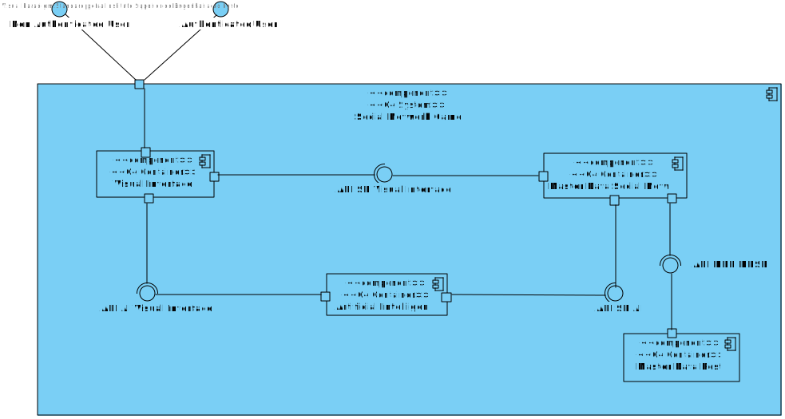
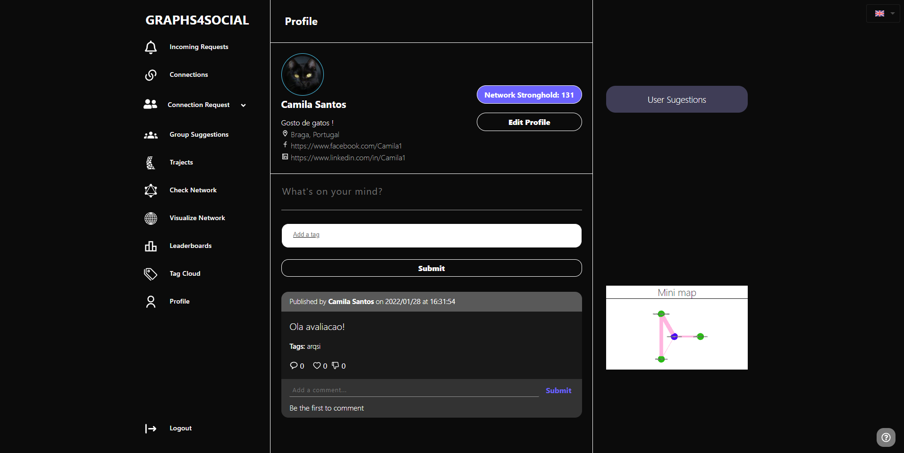
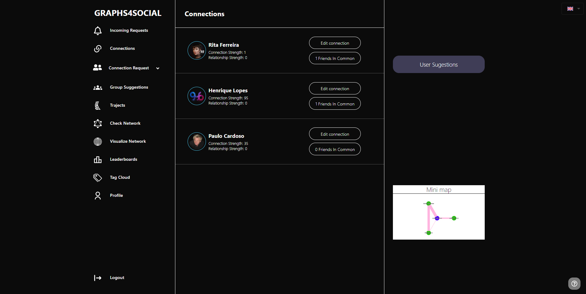
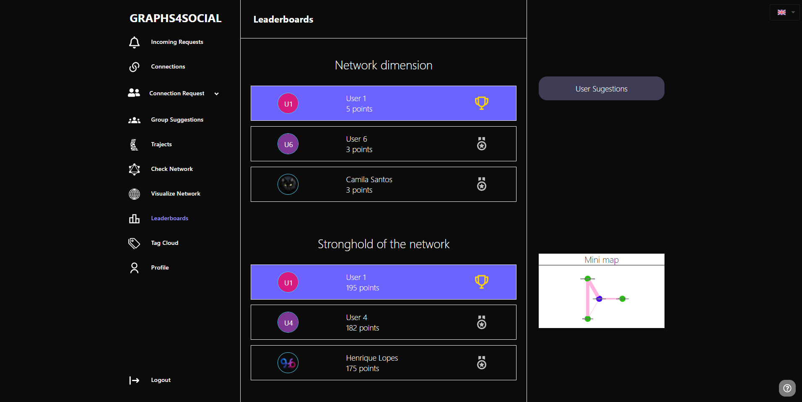
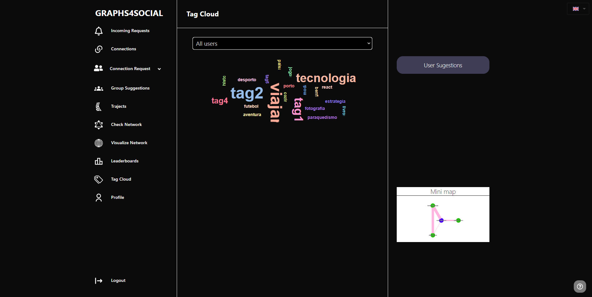
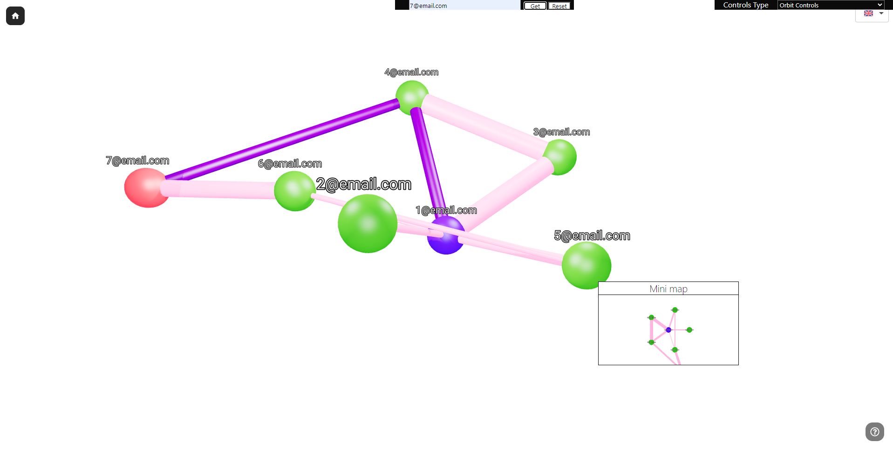
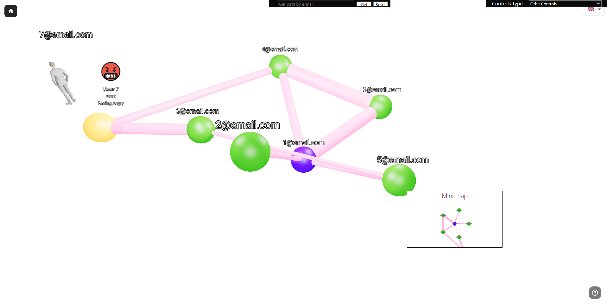

# LAPR5 2021/2022 - ISEP LEI

Social Network gamification in which the player has to connect with other people in order to climb the leaderboards.

## Modules

* **MDSN** - Master Data Social Network - Main backend focused in the social network operations (Technologies: C#, ASP.NET, EFCore, SQLServer)
* **MDP** - Master Data Posts - Backend focused in post/comment/reaction operations (Technologies: TypeScript, NodeJS, Express, MongoDB)
* **SPA** - Visual Interface (Website) - Frontend that supports the interaction of the user with all the functionalities (Technologies: Javascript, ReactJS, ThreeJS, CSS)
* **AI** - Artificial Intelligence - Prolog module (REST) focused in finding paths between users and suggesting users/groups

The following diagram shows the workflow of the modules:

The complete documentation of the project can be seen in the [wiki](wiki/Home.md)

## Prints

