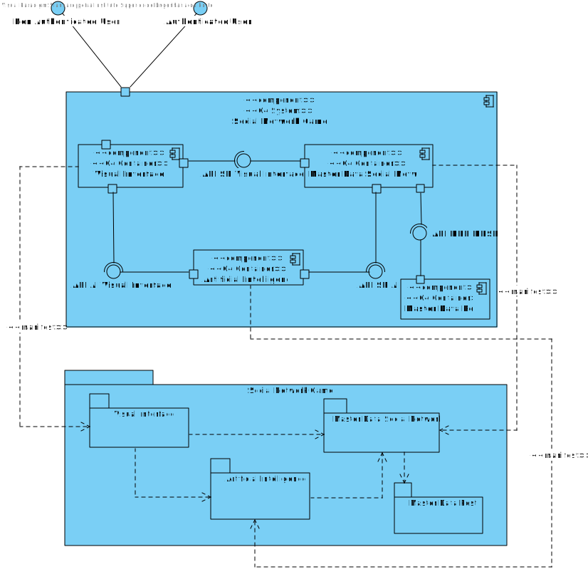
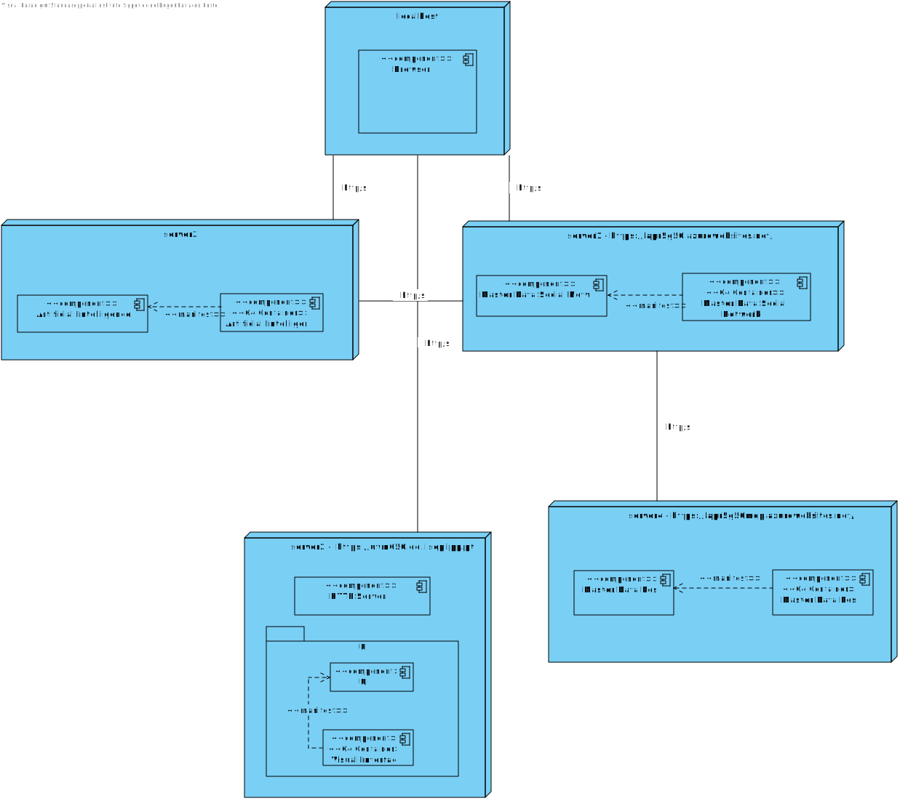
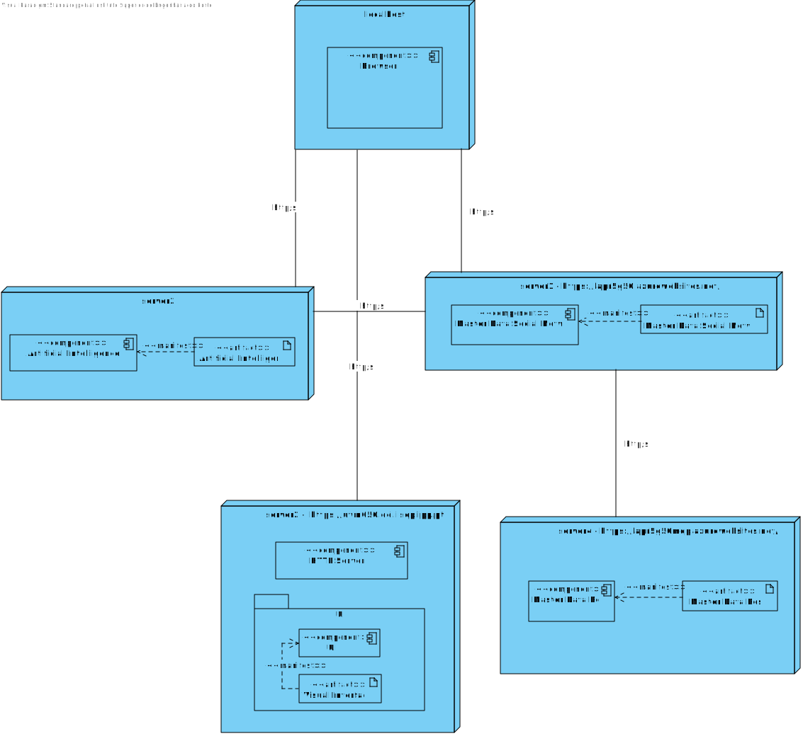
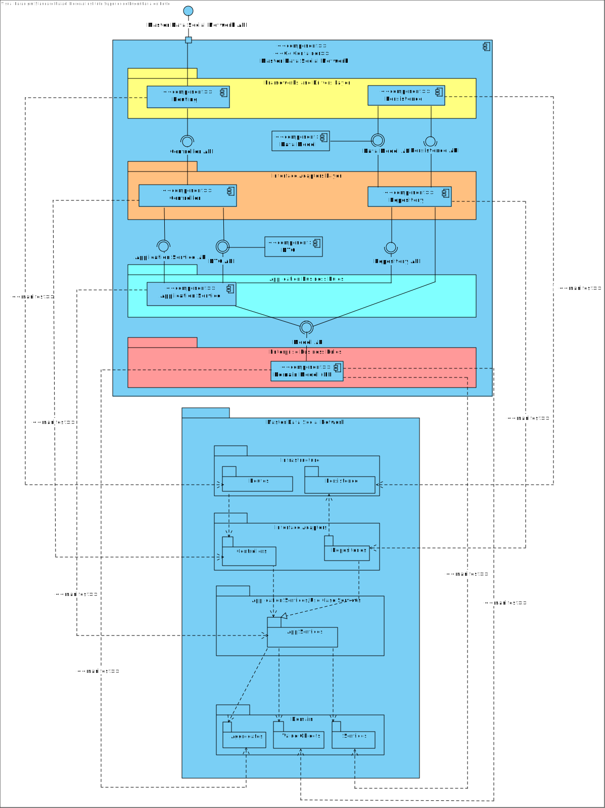
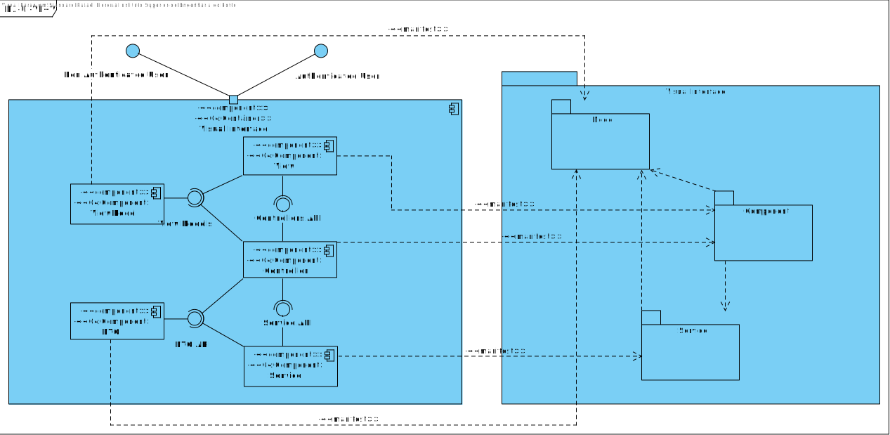
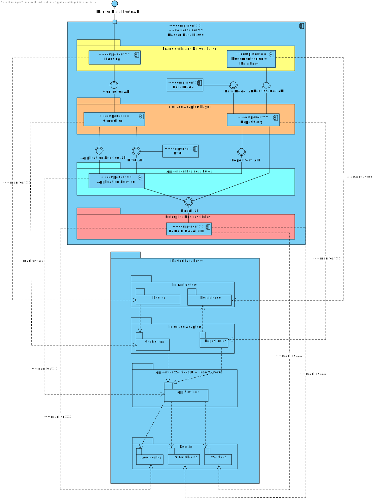

- [Mapping between Views](#mapping-between-views)
	- [Nível 1](#nível-1)
	  - [Vista Lógica - Vista de Implementação](#vista-lógica---vista-de-implementação)
	  - [Vista de Implementação - Vista Física](#vista-de-implementação---vista-física)
	- [Nível 2](#nível-2)
	  - [Vista Lógica - Vista de Implementação](#vista-lógica---vista-de-implementação-1)
	  - [Vista de Implementação - Vista Física](#vista-de-implementação---vista-física-1)
	- [Nível 3 (MDR)](#nível-3-mdr)
	  - [Vista Lógica - Vista de Implementação](#vista-lógica---vista-de-implementação-2)
	  - [Vista de Implementação - Vista Física](#vista-de-implementação---vista-física-2)
	- [Nível 3 (UI)](#nível-3-ui)
	  - [Vista Lógica - Vista de Implementação](#vista-lógica---vista-de-implementação-3)
	  - [Vista de Implementação - Vista Física](#vista-de-implementação---vista-física-3)
	- [Nível 3 (MDV)](#nível-3-mdv)
	  - [Vista Lógica - Vista de Implementação](#vista-lógica---vista-de-implementação-4)
	  - [Vista de Implementação - Vista Física](#vista-de-implementação---vista-física-4)
	- [Nível 3 (Planeamento)](#nível-3-planeamento)
	  - [Vista Lógica - Vista de Implementação](#vista-lógica---vista-de-implementação-5)
	  - [Vista de Implementação - Vista Física](#vista-de-implementação---vista-física-5)
	  - [Nível 3 (Planeamento)](#nível-3-planeamento)
	- [Nível 3 (UI)](#vista-lógica---vista-de-implementação-5)
	  - [Vista Lógica - Vista de Implementação](#Vista Lógica-Vista-de-Implementação-6)

# Mapping between Views

## Nível 1
### Vista Lógica - Vista de Implementação

n/a

### Vista de Implementação - Vista Física

n/a

## Nível 2
### Vista Lógica - Vista de Implementação 

### Vista Lógica - Vista Física

### Vista de Implementação - Vista Física

## Nível 3 (Social Network Master Data)
### Vista Lógica - Vista de Implementação

### Vista de Implementação - Vista Física
TBD

## Nível 3 (UI)

### Vista Lógica - Vista de Implementação

## Nível 3 (Social Network Posts)
### Vista Lógica - Vista de Implementação

